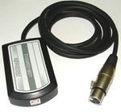

# sound2dmx Project
A Project to generate a compelling light show from a music live-stream

# Hardware
## KMtronic DMX adapter
https://info.kmtronic.com/kmtronic-dmx-adapter.html

## Involight Crystal LED BALL 53
https://www.deejayladen.de/de/involight-crystal-led-ball-53/pd/60632

* Ch1: flash speed  
* Ch2: red  
* Ch3: green  
* Ch4: blue  
* Ch5: rotation  
  - 0-127: angle position  
  - 128-255: rotation speed  
    - 128-142: very slow  
    - 143-157: still slow  
    - 158-172: normal  
    - 173-187: fast  
    - 188-202: 70 swings per minute  
    - 203-217: 82 swings per minute  
    - 218-232: 88 swings per minute (RAP)  
    - 233-247: 111 swings per minute (HOUSE)  
    - 248-255: 142 swings per minute (TECHNO)  
  
# Software
## DMX USB Driver
https://ftdichip.com/drivers/d2xx-drivers/

## D2XX Programmer's Guide
https://ftdichip.com/wp-content/uploads/2020/08/D2XX_Programmers_GuideFT_000071.pdf

# Usage
## Test the DMX interface by sending 
python .\check-dmx-interface-ftd2xx.py

## Run the ligth show
WIP

## Configure parameters
WIP

# Helpful Links 
#### Decimal-hexadecimal-binary conversion table: 
https://kb.iu.edu/d/afdl

#### DMX explained
https://community.element14.com/technologies/open-source-hardware/b/blog/posts/dmx-explained-dmx512-and-rs-485-protocol-detail-for-lighting-applications

#### KMTronic programming example
https://info.kmtronic.com/control-dmx512-devices-via-raspberry-pi.html

#### Python wrappers around the D2XX DLL from FTDI
https://pypi.org/project/ftd2xx/
https://github.com/snmishra/ftd2xx 
https://pypi.org/project/PyDMX/
https://pypi.org/project/PyDMX-Drivers-FTDI/ 

#### Audio motion analyzer
https://github.com/hvianna/audioMotion-analyzer

#### Open Sound Control server and client implementations in pure python (3.5+)
https://pypi.org/project/python-osc/

#### Open Sound Control library for JavaScript applications
https://www.npmjs.com/package/osc-js

#### DMX controller library for node.js
https://github.com/node-dmx

