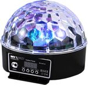

# sound2dmx Project
A Project to generate a compelling light show from a music live-stream

# Hardware
## KMtronic DMX adapter
https://info.kmtronic.com/kmtronic-dmx-adapter.html

## Involight Crystal LED BALL 53
https://www.deejayladen.de/de/involight-crystal-led-ball-53/pd/60632

Ch1: flash speed
Ch2: red
Ch3: green
Ch4: blue
Ch5: rotation
  0-127: angle position, rotary speed , 143-157: faster, , 188-202: insane, 203-217: warp 9
  128-255: rotation speed
    128-142: very slow
    143-157: still slow 
    158-172: normal 
    173-187: fast
    188-202: 70 swings per minute
    203-217: 82 swings per minute
    218-232: 88 swings per minute (RAP)
    233-247: 111 swings per minute (HOUSE)
    248-255: 142 swings per minute (TECHNO)
  
# Software
## DMX USB Driver
https://ftdichip.com/drivers/d2xx-drivers/

## D2XX Programmer's Guide
https://ftdichip.com/wp-content/uploads/2020/08/D2XX_Programmers_GuideFT_000071.pdf

# Usage
## Test the DMX interface by sending 
python .\check-dmx-interface-ftd2xx.py
